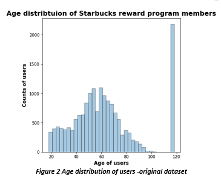

# Starbucks Promotional Strategy: A Machine Learning Approach

There has been an exponential increase in the use of Artificial Intelligence (AI) and Machine Learning (ML) in the marketing  strategy by businesses around the globe. AI and ML  have impacted not just marketing and sales but various other field in an unprecedented way (Siau & Yang, 2017). Use of metadata and social networks for promotions have increased  and have led to increased profits (Sundsoy, Bjelland, Asif, Pentalnd, & Yves-Alexandre). 
In this project, we developed a  machine learning approach to analyze the customer behavior on the Starbucks reward mobile app. The data set consisted of simulated data that mimics the customer behavior. ML approach used Principle Component Analysis (PCA) (Dezyre.com, n.d.), XGBRegressor (Xgboost, n.d.), and GridSearchCV (Scikitlearn, n.d.) for prediction. 
The data for this project was provided by Starbucks Inc. Starbucks data set consisted of three files namely

- portfolio.json
- profile.json
- transaction.json

portfolio.json contained metadata about each offer, profile.json contained demographic data of users, and transcript.json contained transactional data. 
#### Portfolio.json
portfolio.json consisted of below features
-	channels (methods used to send offer to users)
-	difficulty (minimum spending before offer applies)
-	duration (duration validity of offer)
-	id  (offer id)
-	offer_type  (type of offer sent  to users)
-	reward ( reward to be applied during valid offer duration after difficulty level achieved)
#### profile.json:
profile.json consisted of below features
-	age (age of user)
-	became_member_on (user became member on that day)
-	gender (gender of user)
-	id ( user id)
-	income (income of user)
#### transcript.json:
transcript.json consisted of below features
-	event ( kind of event occurred, e.g. offer received, offer viewed, transaction made etc.)
-	person (user id)
-	time (time at which event occurred)
-	value ( monetary value of the transaction)

The objective of the project is to combine transaction, demographic, and offer data to determine which demographic groups respond best to which offer type. This data set is a simplified version of the real Starbucks app because the underlying simulator only has one product whereas Starbucks actually sells dozens of products.

### Problem Statement:

The goal is to determine which demographics respond best to what type of offer so that they can be sent only that type of offer to maximize profitability.  We also want to make sure, not to send offers to customers who are already loyal to Starbucks brand as they will make purchases with or without offer, and to the customers who might stop purchasing because of offers as they might not want to participate in the company marketing campaign. The task involved in this project are the following:
-	Pre-process portfolio.json, profile.json, and transcript.json

-	Predict age, gender, and income distribution of missing data using gradient boosted tree regressor and classifier. 

-	Merge predicted data for missing values with known data

-	Do feature engineering to calculate monthly profits made for each offer type

-	Analyze monthly profits for each offer type and look at trends

The final analysis are expected to shed light on the type of offer and demographics that Starbucks should target for maximum profitability.

### Metrics:
 Metric used to see the best offer is monthly profit and number of transactions in that particular month. 
Metrics used for data pre-processing are below
-	Root Mean Squared Error (RMSE) (Wikipedia, n.d.)
- F1 score (Wikipedia, n.d.)
RMSE is a commonly used to optimize the models. Optimization of model involve minimizing RMSE 

Interpretation:
TP: model predicted positive and its correct
FP: model predicted positive and it is false
TN: model predicted negative and it is true
FN: model predicted negative and it is false

### Analysis:
#### Data Exploration and Data Visualization: 
When we took a first look at the data, we could see that there are total of 10 offers available, with varying degree of difficulty, rewards, and duration. These offers are sent to users through a variety of channels, e.g. email, web , and social media.

Now similarly we take a  look at the profile data set.

There were total of 17000 users who were part of this study. By looking at the data it was clear that the data is not complete and has big fraction as missing values. This would require us to use either NAN fill technique or a ML algorithm to  predict values based on user behavior.  We looked at the age, gender, and income distribution of these users. 
Looking at the histogram on the right, we could see a potential problem in the data set. More than 12% of users are 118 years old. This suggests that this is some default age that system is automatically populating in the data when user doesn’t provide the information. 

When we analyzed the gender distribution, we could see that there are more men who are Starbucks reward user than women. We can also see that we do not have gender distribution for all 17000 users and there are definitely missing values. 
Looking at income distribution we can see that most users have annual income greater than $60,000. By looking further we also concluded that for users whose gender was missing, their income data was also missing and they all seem to have an age of 118 years old which was highly unlikely to be true. This seems to solidify our suspicion that 118 is the default age that system is populating when user doesn’t provide that information 

while signing up for the rewards program. However, system doesn’t provide any default value for gender and income, when user doesn’t provide that info. We confirmed that by plotting histograms for age with missing gender info, and income distribution

Since 12% of data either has missing values, or incorrect age, which is significant portion of the total data set. Instead of dropping that data, we used an ML algorithm to predict users age, gender, and income data

By looking at the transactional data we could see that transcript data consist of dictionary under the column name value, which contains offer_id. offer_id is also available in the portfolio data. We extracted info from this dictionary and merged the table transaction with portfolio. Another thing to be noted here was that, booth transcript and portfolio did not have any missing values, so the missing value processing was needed to be only done on the profile data set. First we extracted the info from dictionary
### Methodology:
#### Data Preprocessing:
Now we will describe the methodology we used for processing our data. Detailed step by step process can be followed in the attached file data processing.ipynb file.
-	LabelEncoder() (Scikit-learn, n.d.)
LabelEncoder was used to convert the hash values in data set such as person id to more useable values. LabelEncoder was used to transform profile, portfolio, and transcript data sets.
 After that, we divided the data set into sub data sets where transaction was made during offer or if the transaction was made without offer. We further broke down the transcript data set into offer received, offer viewed, and offer completed data sets based on the event column. After doing some further data processing (outlined in data processing.ipynb) we merged data with all offers to see which user have received, viewed, and completed offers, or received, viewed but have not completed offer, and received but not viewed offer. After that we defined a function to see if the particular promo was successful or not. We also checked for same users receiving the same offer again. We found that there are no such users who received the same offer twice or more times. 
Transactional behavior was tracked using number of offers of particular type received, number of offers of particular type successful, number of offers of particular type tried, percentage of offers completed, percentage of offers tried, total amount of money spent during the offer validity period, number of transactions during the offer validity period, and average spending per transaction during the offer validity period. Then we calculated the statistics for each user for each type of offer i.e. Buy One Get One (BOGO), Discount, and Informational.
After calculating above statistics, we separated the data with missing values from the data without missing values. 
After separating missing values  we moved towards model application to predict age, gender, and income data for the missing values data set. 
#### Implementation, Model Evaluation, and Validation:
Calculating above statistics resulted in creation of large number of features that might not be useful for the model to do prediction. So we  use PCA for dimensionality reduction. PCA is a dimension-reduction tool that is used to reduce the large set of variables into a minimum set that still contains enough information to fully characterize the large set. This procedure transforms a number of correlated variables into a small number of uncorrelated variables called principle components (PC).  (NCSU, n.d.)
The first PC accounts for as much of variability in the data as possible, and each succeeding PC accounts for as much of the remaining variability possible. 
We used PCA to estimate the number of components needs to best explain the variance in the data set.  We could see below that n=50, variance levels off, we used  n= 50. 

We used XGBRegressor and XGBClassifiers as models for age, income (regression problems) and gender (multiclass classification problem). We used Grid search to optimize the model and we used K-Fold cross validation with 5 folds. 
Now by using these model we were able to predict age, income, and gender of missing values in the data set. Below are the new age, gender, and  income distribution
Now we can see the income distribution of the users with missing data, it is uniform distribution however our RMSE metric is very high 26188 but since the model is only relying on engineered features, and model has not insight into the characteristic of the data so this results is acceptable

##### Income best parameters:
max_depth =8, min_child_weight = 100, 
n_estimator = 150
Similarly we did the age prediction of the missing values. RMSE again was not favorable and was high 17.84 but as suggested above, model is relying on engineered features so the result is acceptable

##### Age best parameters:
max_depth =8, min_child_weight = 470,  n_estimator = 100

##### Gender best parameters:
max_depth =7, min_child_weight = 490,  n_estimator = 100

After predicting the missing values, we merged the predicted data with known data (i.e. without missing values) to recreate profile data set so that we can do some further statistics. The data was saved as .csv file so that we do not have to run the models repeatedly

#### Feature Engineering:
After recreating profile data set, age, income, and gender distributions were replotted to confirm we do not  have any anomalies in the data.

After merging, we recreated some of the features for the whole date set that we created above. After that we created the monthly transactional data for each offer. This was done by calculating the cross product of all successful offer, tried offers with all transaction data. We checked if spending occurred during the validity of the offer, before or after. If the offer is successful, then the spending should occur after the offer is received, viewed, transactions made, and redeemed (i.e. reward received by user). Similarly if the offer is tried, it would be received, viewed, transaction made however reward is not redeemed. 
We also calculated monthly spending for each offer and also calculated the month during which offer was most profitable
### Results:
Below are the months during which particular offer was most profitable

Above charts show the profit made for each offer in particular month and profit made without that particular offer in that month. The month number is the number of months since the member became rewards user to the time member received the offer. 
We can see that each offer has a month where it is highly profitable. So each offer should be focused on users with different months category. e.g. Offer 8 brings in higher profit for month 16, i.e. users who joined program 16 months ago are more prone to using such offer. So when a user turns 16 months old from the time they joined the rewards program, they should be sent offer number 8. 
Similarly offer 1,2, 7 and 9 are more profitable in the month number 13, offer 3, and 4 in the month number 16, offer 0, and 5 in the month number 11, and offer 6 is more profitable in month number 5. 
This  gives company the strategy to look at the time member signed on, and target the demographics according to time elapsed since the sign on. Customers who have been with Starbucks for large number of months might be targeted for difficult offers which offers large rewards but difficulty level is also high.  A loyal customer would be more willing to purchase high price item to complete the offer.

### Conclusion:
#### Reflections: 
The process used for this project can be summarized below
-	Initial problem, and download of relevant data set provided by Starbucks
-	Processing of data set
-	Visualization of data set
-	Feature engineering to create statistics
-	Using PCA to reduce dimensionality
-	Using gradient boosted tree regressor and classifiers to predict missing data
-	Recreating features and creating monthly transaction features
-	Visualizing trends
I found the prediction of missing feature part most difficult, as the metrics were not ideal, I had to read up the documentation for gradient boosted tree. I consulted with my mentor as well, and he suggested that I should look into decision trees for such a problem. As mentioned earlier, metrics were no favorable, but because model was relying on engineered features, which suggested that the results are acceptable. I believe I will be using such models with engineered features in future as well. 
Improvements:
We only had 4 demographic attributes, more attributes could be provided to improve the model prediction and accuracy. 
Further improvements can be made, if only send offers to the customers who respond to it, as offers may be costly and hit the bottom line of the company. Another improvement that can be made to the above analysis is to use regression model to predict the profit of promotional and no promotional offers on the monthly data. Such a model was not used due to machine and time limitation. 
##### Github: 
Link to github is below
-	https://github.com/tmuzaffa/Capstone

##### Data: 
Link to month_data.csv is below
-	https://drive.google.com/open?id=1xBSCFzOz3u4_acn9XshoDW1qZzMCU0SB 

### Libraries used for the project 

Following python libraries:

1. Pandas
2. Matplotlib 
3. NLTK
4. NumPy
5. Pickle
6. Seaborn
7. Sklearn
8. LabelEncoder
9. StandardScaler
10. Shuffle
11. GridSearchCV
12. StratifiedKFold
14. Confusion_ MAtrix
15. Log_Loss
16. F1 Score
17. PCA
18. Mean Squared Error
19. XGBoost

I used the Anconda python distribution with python 3.0

### Acknowledgements

- This data set is  provided to us by Starbucks
- .dsecribe() > https://www.geeksforgeeks.org/python-pandas-dataframe-describe-method/
- Pyplot> https://matplotlib.org/3.1.1/gallery/pyplots/pyplot_text.html#sphx-glr-gallery-pyplots-pyplot-text-py
- Remove/find duplicates > https://pandas.pydata.org/pandas-docs/stable/reference/api/pandas.DataFrame.duplicated.html
- Nunique() > https://www.geeksforgeeks.org/python-pandas-dataframe-nunique/
- Most frequent index > ### Ref: https://stackoverflow.com/questions/48590268/pandas-get-the-most-frequent-values-of-a-column/48590361
- Unstack data frame > #Ref: https://pandas.pydata.org/pandas-docs/stable/reference/api/pandas.DataFrame.unstack.html
- Setdiff1d  > https://docs.scipy.org/doc/numpy/reference/generated/numpy.setdiff1d.html
- Linear Algebra > Ref: https://docs.scipy.org/doc/numpy/reference/routines.linalg.html
- PCA > Ref: https://www.dezyre.com/data-science-in-python-tutorial/principal-component-analysis-tutorial
- PCA2 > Ref: ftp://statgen.ncsu.edu/pub/thorne/molevoclass/AtchleyOct19.pdf
- GridSearchCV > Ref:: https://scikit-learn.org/stable/modules/generated/sklearn.model_selection.GridSearchCV.html
- Siau, K., & Yang, Y. (2017). Impact of Artificial Intelligence, Robotics, and Machine Learning on Sales and Marketing. Proceedings of the Twelfth Midwest Association for Information Systems Conference,, (p. 48). Springfield.
- Sundsoy, R., Bjelland, J., Asif, M. I., Pentalnd, A., & Yves-Alexandre, d. M. (n.d.). Big Data-Driven Marketing: How Machine Learning Outperforms Marketers’ Gut-Feeling. In Social Computing, Behavioral-Cultural Modeling and Prediction. Springer.
- Towardsdatascience. (n.d.). Retrieved from https://towardsdatascience.com/understanding-confusion-matrix-a9ad42dcfd62
- Mean Squared Error > Ref: https://en.wikipedia.org/wiki/Mean_squared_error
- F1 Score> Ref: https://en.wikipedia.org/wiki/F1_score
- Precision and Recall > Ref:https://en.wikipedia.org/wiki/Precision_and_recall
- XGBoost > Ref: https://xgboost.readthedocs.io/en/latest/python/python_api.html
- Starbuck logo > Ref: https://en.wikipedia.org/wiki/Starbucks
- Datetime > Ref: https://stackoverflow.com/questions/27506367/python-pandas-integer-yyyymmdd-to-datetime
- Date Extraction > Ref: https://stackoverflow.com/questions/21954197/which-is-the-fastest-way-to-extract-day-month-and-year-from-a-given-date
- Dictionary > Ref: https://stackoverflow.com/questions/46405974/extract-values-from-dictionaries-in-dataframe-columns
- Pipe Character > Ref: https://stackoverflow.com/questions/5988665/pipe-character-in-python
- Rename Dataframe > Ref: https://pandas.pydata.org/pandas-docs/stable/reference/api/pandas.DataFrame.rename.html
- Rounding Number > Ref: https://www.knowledgehut.com/blog/programming/python-rounding-numbers
- https://github.com/scikit-learn/scikit-learn/issues/3123
- DataFrame > Ref: https://stackoverflow.com/questions/46405974/extract-values-from-dictionaries-in-dataframe-columns
- HotEncoder > Ref: https://firecharmca.wordpress.com/2018/03/22/feature-engineering-categorical-value-onehotencoder-and-why-not/
- LabelEncoder > Ref: https://stackoverflow.com/questions/53970350/valueerror-contains-new-labels-when-trying-to-label-encode-in-python
